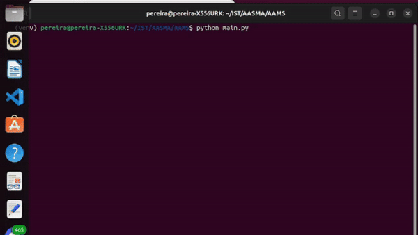

# AAMS

Group Project for the Autonomous Agents and Multi-Agent Systems Course 2023/2024 @ IST

### On the main directory:

1. Install dependencies
  $ pip install -r requirements.txt

2. Execution
  $ python main.py

    flags:
      episodes: number of episodes to execute.
      image: The file name of final plot. The path is always "/model".
      agents: number of agents.
      foods: number of foods.
      save: the model to save. The default name is "model.pth".
      load: the model to load. The default name is "model.pth".
      train: flag to control if it will train or just test.

3. Preview

    
